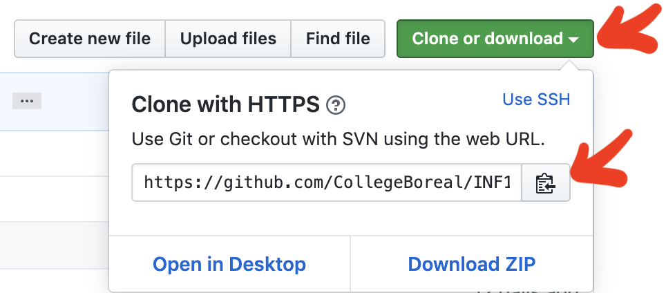

# IDE (Integrated Development Environment)

## :bulb: [Tutoriel sur GIT](https://github.com/CollegeBoreal/Tutoriels/tree/main/0.GIT)

### :o: Installation

:point_right: Suivre l'[Installation](https://github.com/CollegeBoreal/Tutoriels/tree/main/0.GIT/Installation) 

### :one: Les premiers pas avec git

* Ouvrir une fenêtre de ligne de commande
* Creer un repertoire pour faire du développement (en anglais et avec `D` en majuscule)
```sh
mkdir Developer
```
* changer de repertoire pour faire du développement
```sh
cd Developer
```

* Cloner votre premier repertoire git

   - aller sur la page github du cours
   
   - cliquer sur le bouton `clone or download`
   
   - cliquer sur le `presse papier` pour mettre en mémoire l'URL du répertoire

   </image>

   - coller l'URL du répertoire en mémoire dans le presse papier avec RIGHT-CLICK/PASTE
   
   - * example

   ```sh
   git clone https://github.com/CollegeBoreal/INF1042-203-25A-04.git
   ```
   
* allez dans le répertoire du cours

```sh
cd INF1042-203-25A-04
```

### :two: Créer son premier fichier sous git (utiliser vi)
* Creer un fichier et l'éditer, par example un fichier ayant votre :id: Boréal avec l'extension `MarkDown` $\textbf{.md}$
```sh
nano 300098957.md
```
* mettre le fichier en scene (add to stage)
```sh
git add 300098957.md
```
> Vérifier son status avec (doit etre :green_circle: vert)  
```sh
git status
```

* donner un commentaire aux fichiers a enregistrer (commit)
```sh
git commit --message "Mon commentaire"
```
:warning: Se referer à la [:point_right: section](#three-configurer-git-gitconfig) `Configuration d'informations personnelles` pour le premier `commit` 

* envoyer les modifications locales au serveur github
  
```sh
git push
```

:secret: Remonter les informations vers le serveur requiert votre `utilisateur` et `mot de passe`

> Username for 'https://github.com': b300098957
> 
> Password for 'https://b300098957@github.com':

### :three: Configurer GIT `~/.gitconfig`

:bulb: pour soumettre son travail vers `github.com`

* Changer l'éditeur par défaut de `vi` à `nano`

```sh
git config --global core.editor "nano"
```

* Editer son nom utilisateur `github` et son courriel

```sh
git config --global --edit
```

* Rajouter la section `[user]` et remplacer `MonNom` et `MonCourriel@me_remplacer.com` par le votre

```ini
[core]
        editor = nano

[user]
# Please adapt and uncomment the following lines:
        name = MonNom
        email = MonCourriel@me_remplacer.com
```

### :u6307: Metter à jour mon rèpertoire local (pull)
```sh
git pull 
```

## :secret: Configurer git (Clé personnelle) [Documentation](https://docs.github.com/en/free-pro-team@latest/github/authenticating-to-github/adding-a-new-ssh-key-to-your-github-account)

### ~/.ssh/config

:pushpin: Utilisation du port ssh par défaut :two::two:

- [ ] Éditer le fichier de configuration de `SSH`

```sh
nano ~/.ssh/config
```

- [ ] Ajouter le contenu ci-dessous et ajuster le nom de fichier de votre clé publique.

```powershell
Host github.com
    HostName github.com
    User git
    IdentityFile ~/.ssh/mon_fichier.pk
```

## :toolbox: IDE

- [ ] [:beer: HomeBrew Visual Studio Code](https://formulae.brew.sh/cask/visual-studio-code) sur :apple: Apple

```sh
brew install --cask visual-studio-code
```

- [ ] [:chocolate_bar: Chocolatey Visual Studio Code](https://community.chocolatey.org/packages/vscode) sur :window: Windows

```sh
choco install vscode
```

# :books: References


