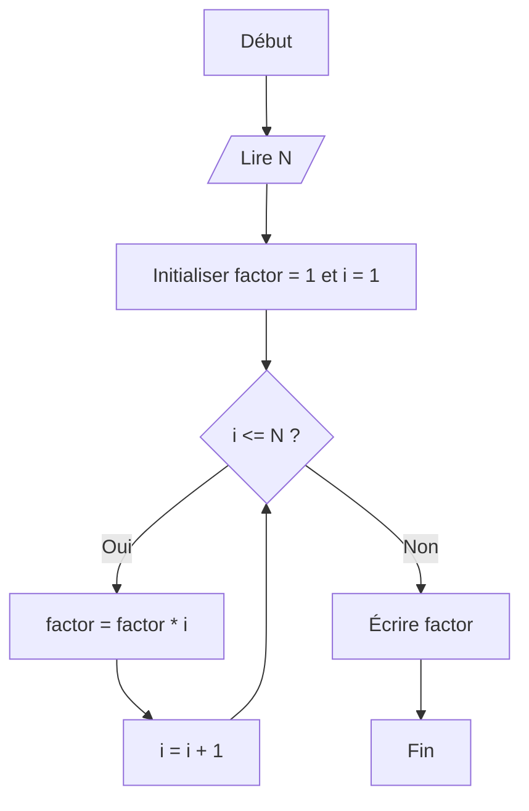
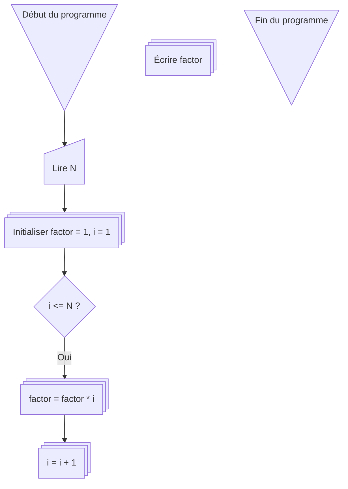
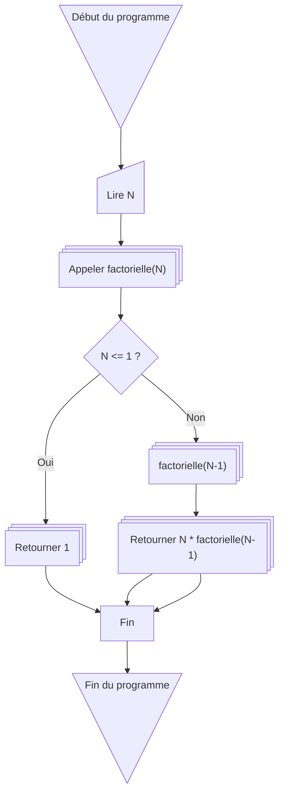

```mermaid
flowchart TD
    A[Début] --> B[/Lire N/]
    B --> C[Initialiser factor = 1 et i = 1]
    C --> D{i <= N ?}
    D -->|Oui| E[factor = factor * i]
    E --> F[i = i + 1]
    F --> D
    D -->|Non| G[Écrire factor]
    G --> H[Fin]
```

```mermaid
flowchart TD
    A@{ shape: manual-file, label: "Début du programme"}
    B@{ shape: manual-input, label: "Lire N"}
    C@{ shape: procs, label: "Initialiser factor = 1, i = 1"}
    D@{ shape: diamond, label: "i <= N ?"}
    E@{ shape: procs, label: "factor = factor * i"}
    F@{ shape: procs, label: "i = i + 1"}
    G@{ shape: procs, label: "Écrire factor"}
    H@{ shape: manual-file, label: "Fin du programme"}

    A --> B
    B --> C
    C --> D
    D -- Oui --> E
    E --> F
```
    F --> D
    D -- Non --> G
    G --> H

```mermaid
    flowchart TD
    A[Début] --> B[/Lire N/]
    B --> C[Initialiser factor = 1 et i = 1]
    C --> D{i <= N ?}
    D -->|Oui| E[factor = factor * i]
    E --> F[i = i + 1]
    F --> D
    D -->|Non| G[Écrire factor]
    G --> H[Fin]
```

```mermaid
flowchart TD
    A@{ shape: manual-file, label: "Début du programme"}
    B@{ shape: manual-input, label: "Lire N"}
    C@{ shape: procs, label: "Appeler factorielle(N)"}
    D@{ shape: diamond, label: "N <= 1 ?"}
    E@{ shape: procs, label: "Retourner 1"}
    F@{ shape: procs, label: "factorielle(N-1)"}
    G@{ shape: procs, label: "Retourner N * factorielle(N-1)"}
    H@{ shape: procs, label: "Afficher résultat"}
    I@{ shape: manual-file, label: "Fin du programme"}

    A --> B
    B --> C
    C --> D
    D -- Oui --> E
    D -- Non --> F
    F --> G
    E --> H
    G --> H
    H --> I
    G --> H[Fin]
```
