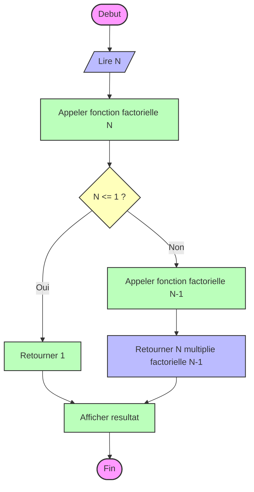

```mermaid
flowchart TD
    style A fill:#f9f,stroke:#333,stroke-width:2px
    style B fill:#bbf,stroke:#333,stroke-width:1.5px
    style C fill:#bfb,stroke:#333,stroke-width:1.5px
    style D fill:#ffb,stroke:#333,stroke-width:1.5px
    style E fill:#bfb,stroke:#333,stroke-width:1.5px
    style F fill:#bfb,stroke:#333,stroke-width:1.5px
    style G fill:#bbf,stroke:#333,stroke-width:1.5px
    style H fill:#bfb,stroke:#333,stroke-width:1.5px
    style I fill:#f9f,stroke:#333,stroke-width:2px

    A([Debut]) --> B[/Lire N/]
    B --> C[Appeler fonction factorielle N]
    C --> D{N <= 1 ?}
    D -- Oui --> E[Retourner 1]
    D -- Non --> F[Appeler fonction factorielle N-1]
    F --> G[Retourner N multiplie factorielle N-1]
    E --> H[Afficher resultat]
    G --> H
    H --> I([Fin])
```
