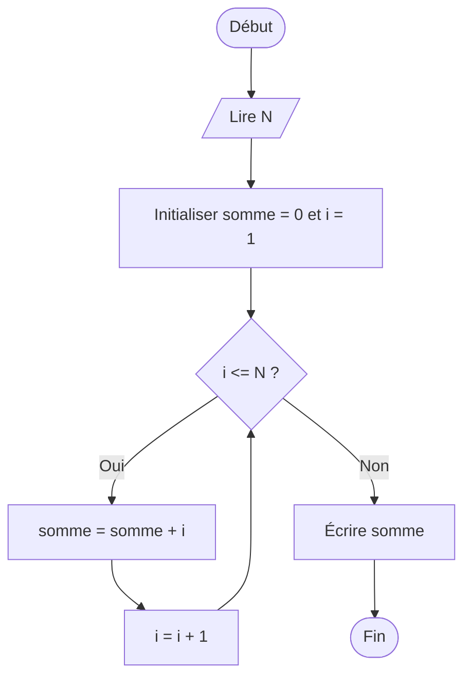

- [ ] La somme d'un chiffre `N`

```mermaid
flowchart TD
    A([Début]) --> B[/Lire N/]
    B --> C[Initialiser somme = 0 et i = 1]
    C --> D{i <= N ?}
    D -- Oui --> E[somme = somme + i]
    E --> F[i = i + 1]
    F --> D
    D -- Non --> G[Écrire somme]
    G --> H([Fin])
```
