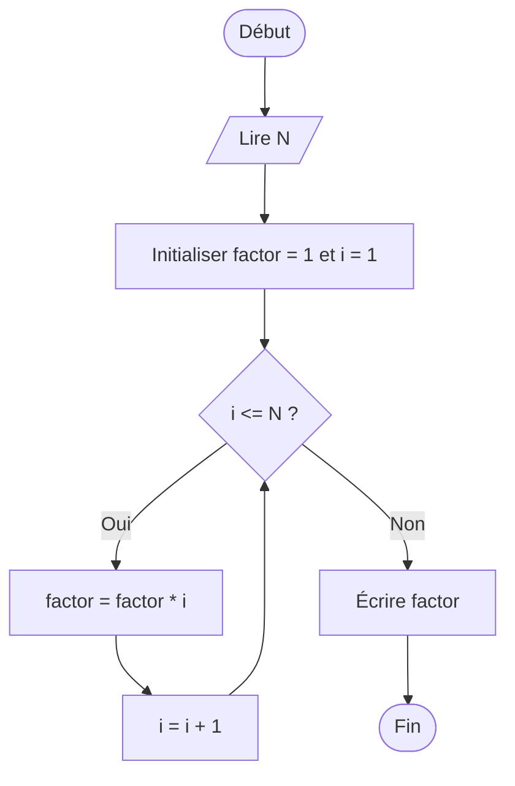

<<<<<<< HEAD
# :abacus:  organigramme de factorielle d'un nombre

=======
# Organigramme : Vérifier si un nombre est pair ou impair

```mermaid
flowchart TD
    A([Début]) --> B[Entrer un nombre]
    B --> C{Le nombre est-il pair ?}
    C -->|Oui| D[Afficher le nombre est pair]
    C -->|Non| E[Afficher le nombre est impair]
    D --> F([Fin])
    E --> F
>>>>>>> e1d50e24795f641c3609493c501757d054c199a0
