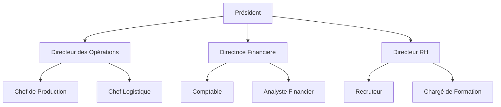

```mermaid
graph TD
  A["Président"] --> B["Directeur des Opérations"]
  A --> C["Directrice Financière"]
  A --> D["Directeur RH"]

  B --> E["Chef de Production"]
  B --> F["Chef Logistique"]

  C --> G["Comptable"]
  C --> H["Analyste Financier"]

  D --> I["Recruteur"]
  D --> J["Chargé de Formation"]

```
