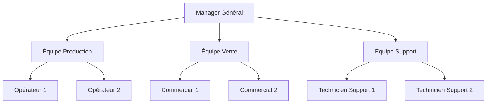

```mermaid
graph TD
  A["Manager Général"] --> B["Équipe Production"]
  A --> C["Équipe Vente"]
  A --> D["Équipe Support"]

  B --> E["Opérateur 1"]
  B --> F["Opérateur 2"]

  C --> G["Commercial 1"]
  C --> H["Commercial 2"]

  D --> I["Technicien Support 1"]
  D --> J["Technicien Support 2"]

```

