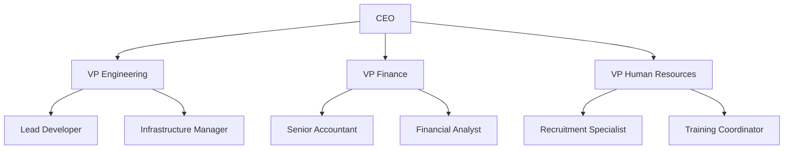

```mermaid
graph TD
  A["CEO"] --> B["VP Engineering"]
  A --> C["VP Finance"]
  A --> D["VP Human Resources"]

  B --> E["Lead Developer"]
  B --> F["Infrastructure Manager"]

  C --> G["Senior Accountant"]
  C --> H["Financial Analyst"]

  D --> I["Recruitment Specialist"]
  D --> J["Training Coordinator"]

```

