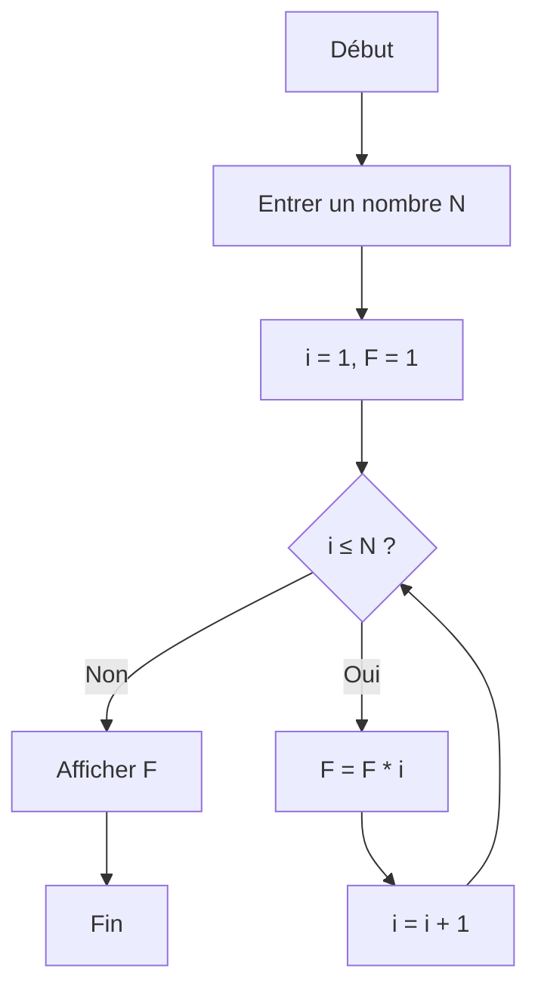

```mermaid
flowchart TD
    A[Début] --> B[Entrer un nombre N]
    B --> C[i = 1, F = 1]
    C --> D{i ≤ N ?}
    D -- Non --> E[Afficher F]
    D -- Oui --> F[F = F * i]
    F --> G[i = i + 1]
    G --> D
    E --> H[Fin]
```
