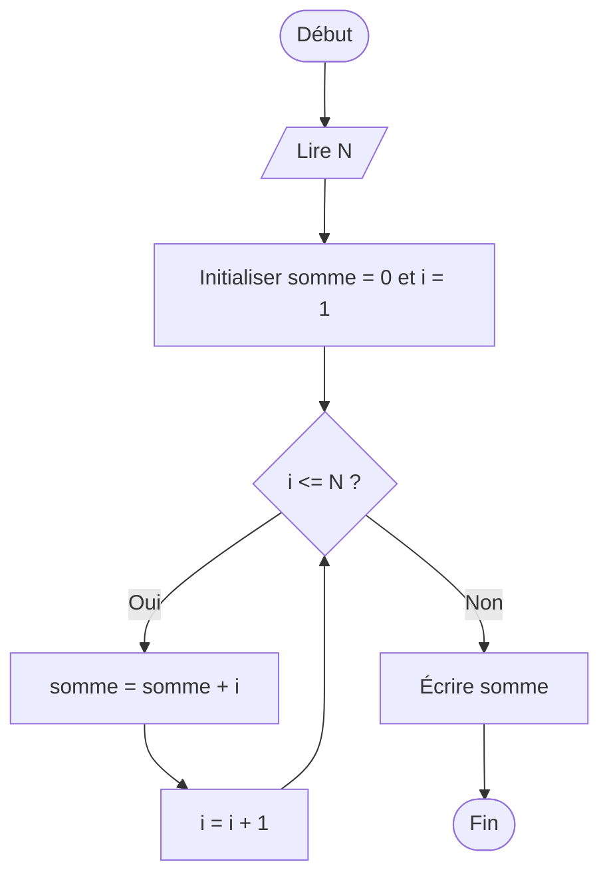
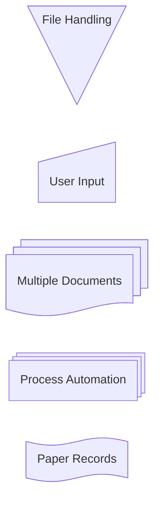
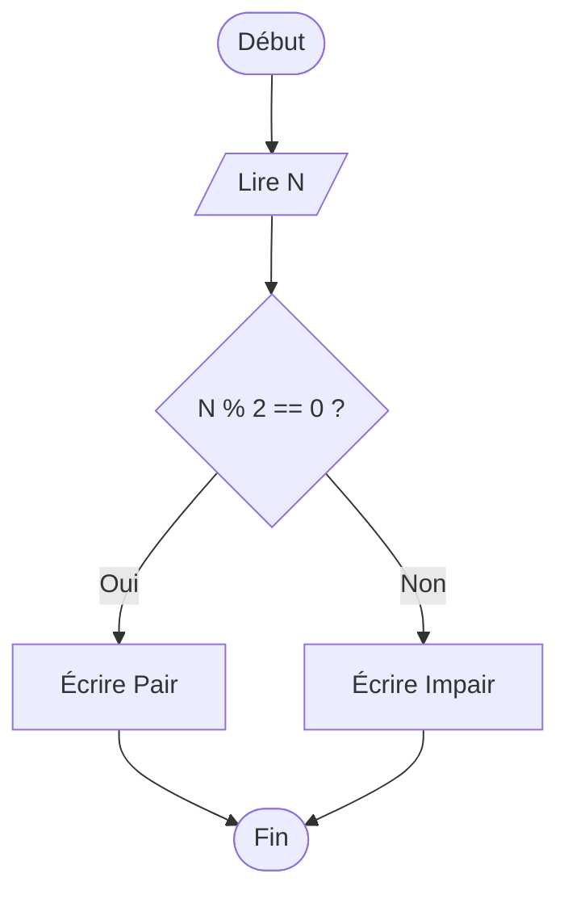

# 3.Organigrammes

[:tada: Participation](.scripts/Participation.md)

## :a: Examples

:bulb: **Flowchart** en Anglais

- [ ] La somme d'un chiffre `N`

- [ ] Un organigramme fonctionnel

- [ ] Un organigramme expliquant la fonction paire

