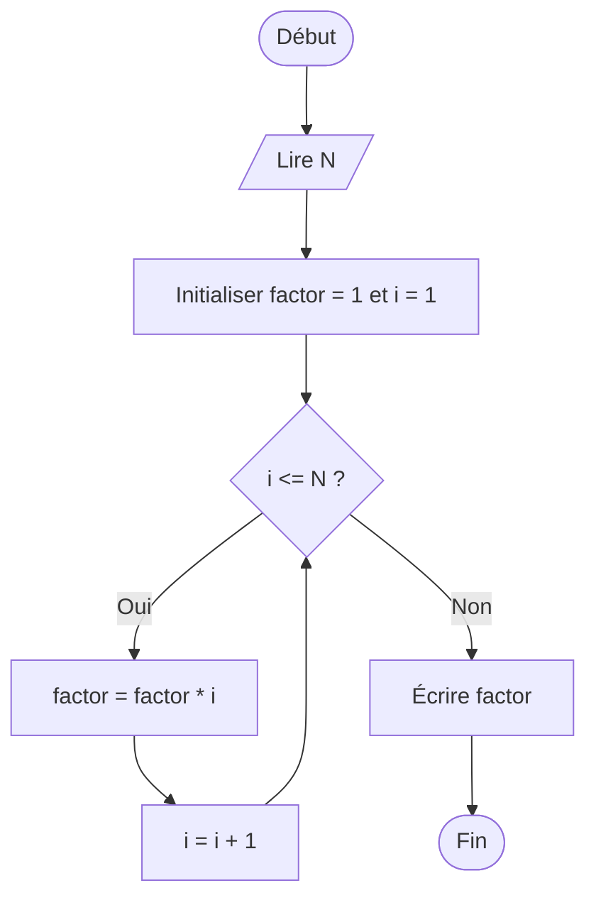
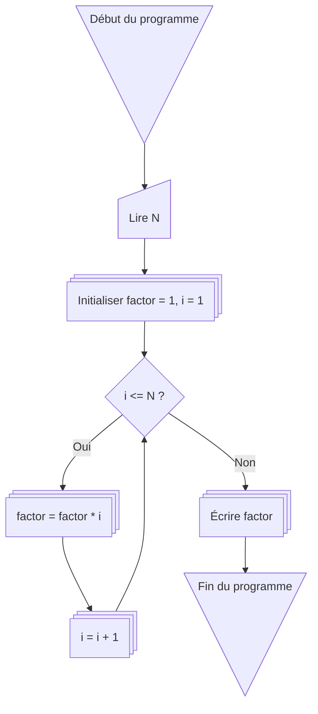

# :abacus: factorielle

Voici un **exemple complet d’organigramme pour le calcul de la factorielle** d’un nombre `N` avec **Mermaid**, prêt pour GitHub Markdown.

---

## 1️⃣ Organigramme classique (boucle)

### Explications :

1. **Début** → le programme commence.
2. **Lire N** → entrée de l’utilisateur.
3. **Initialiser factor = 1 et i = 1** → variable pour stocker le résultat et compteur.
4. **i <= N ?** → condition de la boucle.
5. **factor = factor \* i** → multiplication pour la factorielle.
6. **i = i + 1** → incrémenter le compteur.
7. Boucle jusqu’à ce que `i > N`.
8. **Écrire factor** → afficher le résultat.
9. **Fin** → terminer le programme.

---

## 2️⃣ Version avec **shapes personnalisés** (Mermaid avancé)

> Cette version rend le diagramme plus visuel avec différents styles pour **début/fin**, **entrée**, **instruction**, et **condition**.

---

Si tu veux, je peux aussi te créer **la version factorielle avec récursion** en organigramme Mermaid, ce qui est un peu plus complexe et pédagogique.

Veux‑tu que je fasse ça ?
