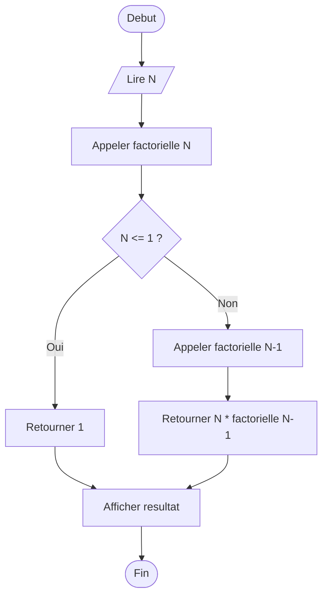
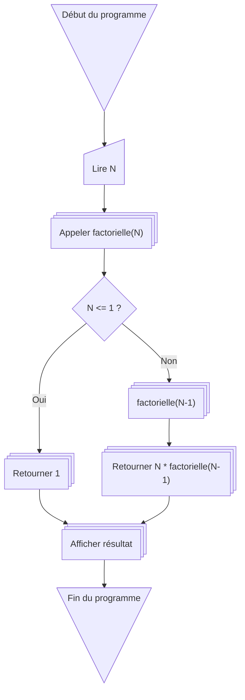

# :abacus: factorielle

# **Leçon : Calcul de la factorielle avec organigrammes**

## 1️⃣ Définition de la factorielle

La **factorielle** d’un nombre entier positif `N` (notée `N!`) est le produit de tous les entiers positifs de 1 à `N` :

$$
N! = 1 × 2 × 3 × … × N
$$

Cas particuliers :

* `0! = 1`
* `1! = 1`

La factorielle est utilisée en mathématiques, statistiques et programmation (permutations, combinaisons, etc.).

---

## 2️⃣ Algorithme itératif

### Étapes :

1. Lire un nombre `N`.
2. Initialiser `factor = 1`.
3. Pour `i` de 1 à `N` : multiplier `factor` par `i`.
4. Afficher `factor`.

---

### 2.1 Organigramme Mermaid classique

---

### 2.2 Organigramme avec **shapes personnalisés**

---

## 3️⃣ Algorithme récursif

### Étapes :

1. Fonction `factorielle(n)` :

   * Si `n <= 1` → retourner 1
   * Sinon → retourner `n * factorielle(n-1)`
2. Lire `N`
3. Appeler `factorielle(N)`
4. Afficher le résultat

---

### 3.1 Organigramme Mermaid classique (récursion)

---

### 3.2 Organigramme avec **shapes personnalisés**

---

## 4️⃣ Bonnes pratiques pour les organigrammes

1. Toujours **commencer par Début** et finir par **Fin**.
2. Utiliser des **formes cohérentes** pour les mêmes types d’actions.
3. Garder le diagramme **simple et lisible**, éviter les croisements de flèches.
4. Mettre des **étiquettes claires** sur les flèches pour les conditions (Oui / Non).
5. Vérifier la logique en parallèle du code.

---

✅ Avec ces exemples, tu as un **tutoriel complet sur la factorielle** en **itératif et récursif**, avec **Mermaid** pour illustrer les algorithmes sur GitHub.
