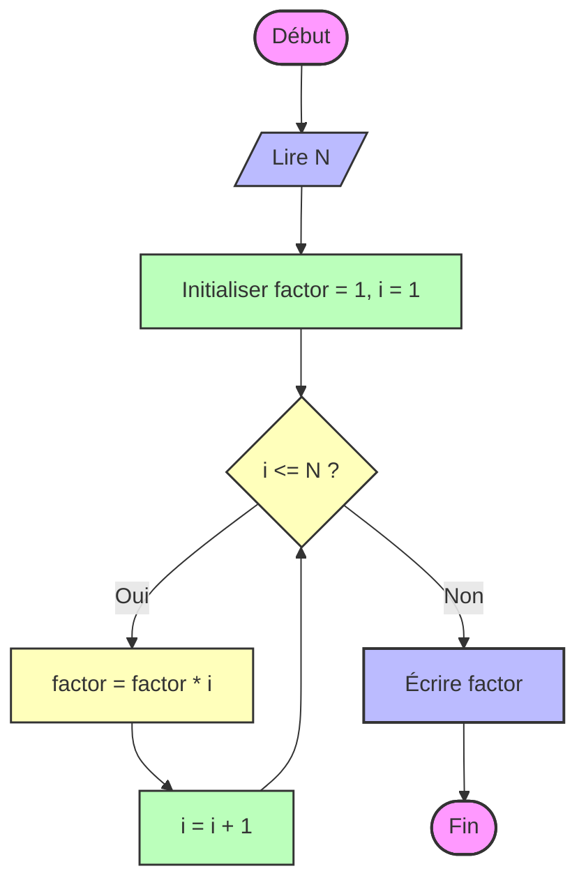
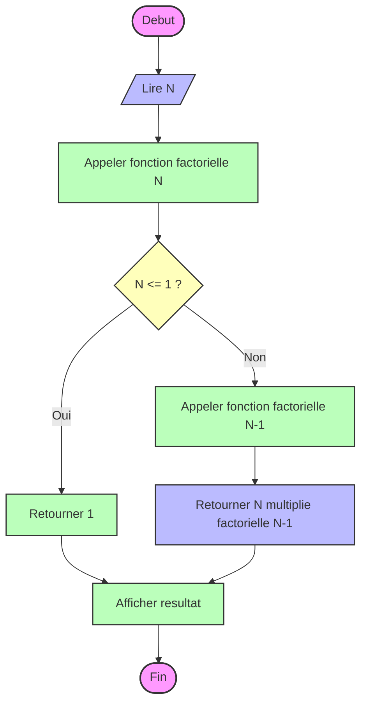
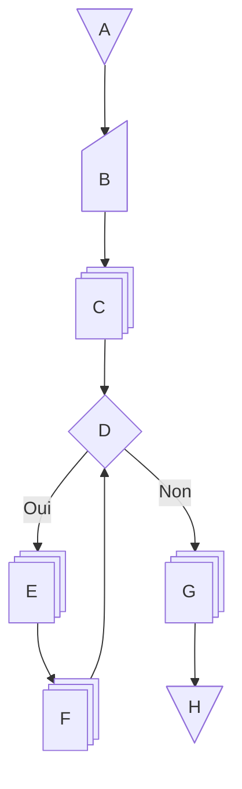

Parfait ! Voici une **version ultra-visuelle et pédagogique** du calcul de la factorielle (itératif et récursif) avec **Mermaid**, utilisant **couleurs, styles et formes**. Cette version est prête pour GitHub Markdown.

---

# **Factorielle – Version visuelle avec couleurs Mermaid**

## 1️⃣ Itératif (Boucle)

**Couleurs :**

* Violet clair → début/fin
* Bleu → lecture / sortie
* Vert → instructions
* Jaune → conditions

---

## 2️⃣ Récursif

**Couleurs :**

* Violet → début/fin
* Bleu → lecture / sortie
* Vert → instructions / retours de fonction
* Jaune → conditions

---

## 3️⃣ Bonus : Styles Mermaid avancés

* Tu peux utiliser des **formes différentes** pour chaque type d’action :

  * `shape: manual-input` pour l’entrée
  * `shape: procs` pour les instructions
  * `shape: diamond` pour les conditions
  * `shape: manual-file` pour début/fin

Exemple itératif stylé :

---

💡 **Résultat :**
Ces versions sont **colorées, structurées et pédagogiques**, parfaites pour :

* GitHub Markdown
* Présentations
* Cours et tutoriels interactifs
