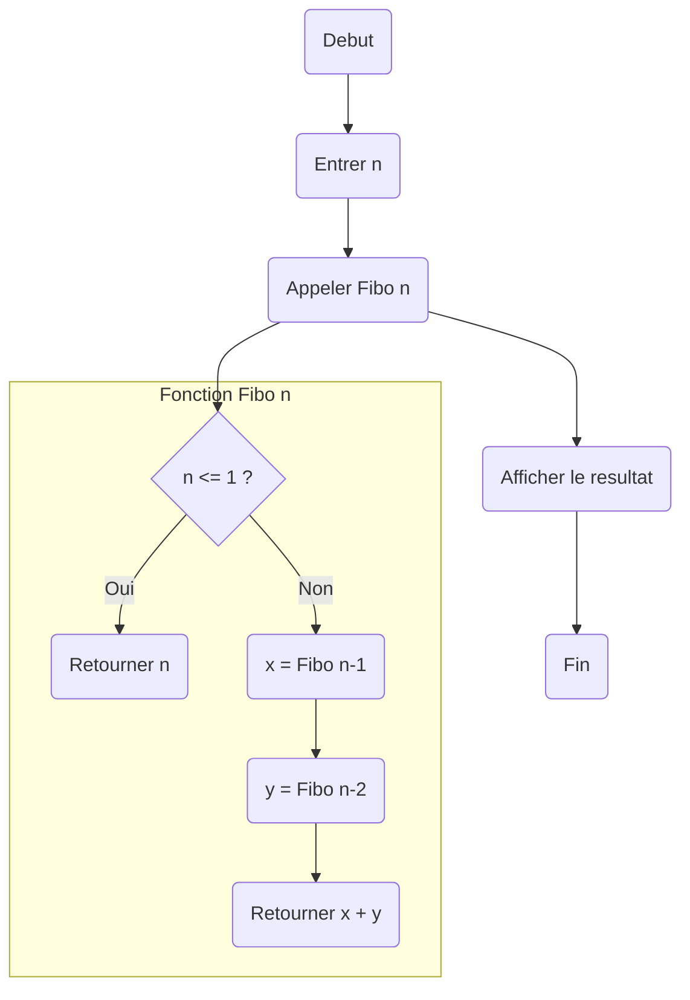

```mermaid
flowchart TD
A0(Debut)
A1(Entrer n)
A2(Appeler Fibo n)
A3(Afficher le resultat)
A4(Fin)

A0 --> A1
A1 --> A2
A2 --> A3
A3 --> A4

subgraph Fibo [Fonction Fibo n]
B1{n <= 1 ?}
B1 -- Oui --> B2(Retourner n)
B1 -- Non --> B3(x = Fibo n-1)
B3 --> B4(y = Fibo n-2)
B4 --> B5(Retourner x + y)
end

A2 --> B1
```
