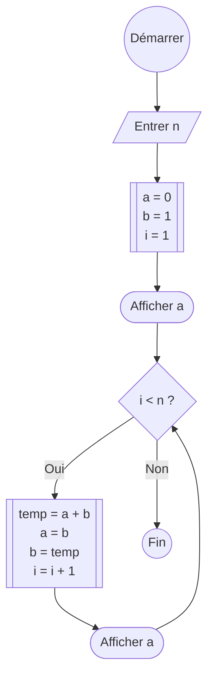

```mermaid
flowchart TD
  start((Démarrer))
  input[/Entrer n/]
  init[[a = 0<br/>b = 1<br/>i = 1]]
  out1([Afficher a])
  cond{i < n ?}
  step[[temp = a + b<br/>a = b<br/>b = temp<br/>i = i + 1]]
  out2([Afficher a])
  fin((Fin))

  start --> input --> init --> out1 --> cond
  cond -- Oui --> step --> out2 --> cond
  cond -- Non --> fin
```
