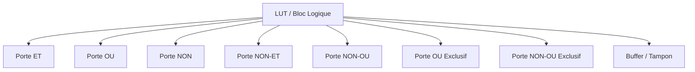
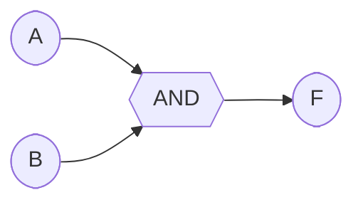
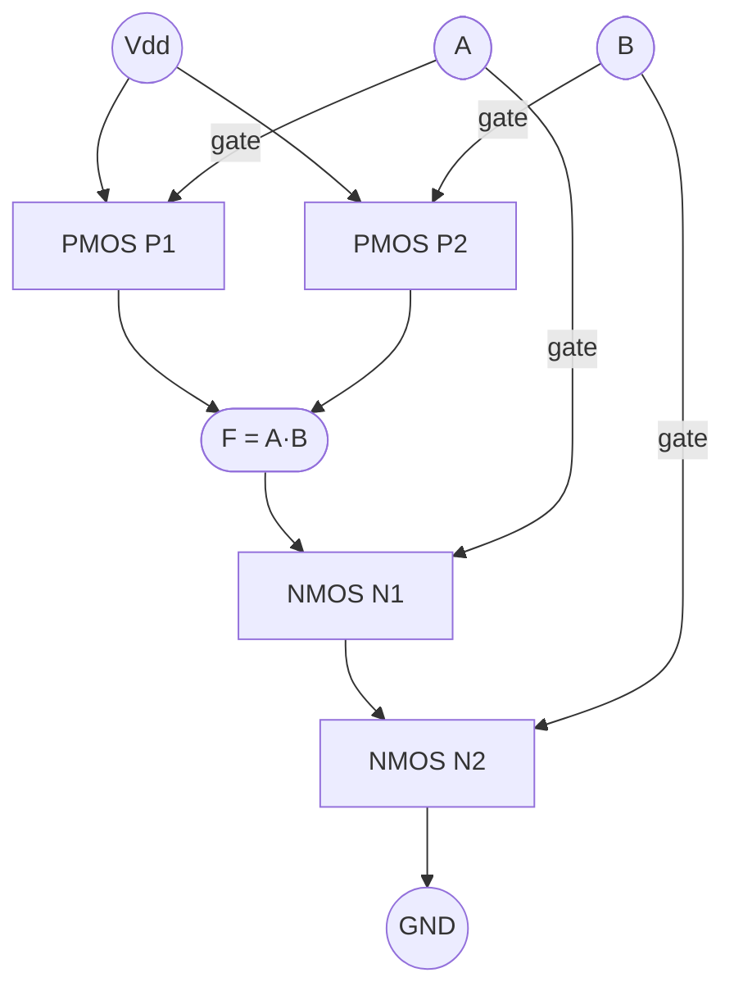

Here’s a handy list of the **most common logic gates in French**, with their English equivalents:

| English        | French                | Symbol / Notes     |
| -------------- | --------------------- | ------------------ |
| AND            | porte ET              | A ⋅ B or A ∧ B     |
| OR             | porte OU              | A + B or A ∨ B     |
| NOT / Inverter | porte NON             | ¬A or A̅           |
| NAND           | porte NON-ET          | ¬(A ⋅ B)           |
| NOR            | porte NON-OU          | ¬(A + B)           |
| XOR            | porte OU exclusif     | A ⊕ B              |
| XNOR           | porte NON-OU exclusif | ¬(A ⊕ B)           |
| BUFFER         | tampon                | just passes signal |

💡 **Tip:** In French textbooks, “porte” = “gate,” and the rest describes the operation.

