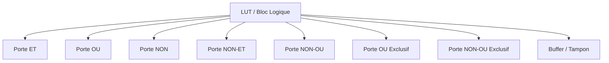
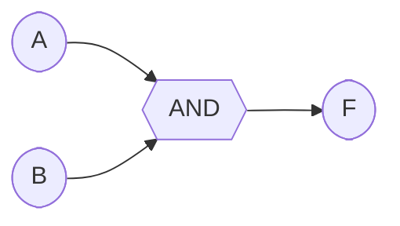
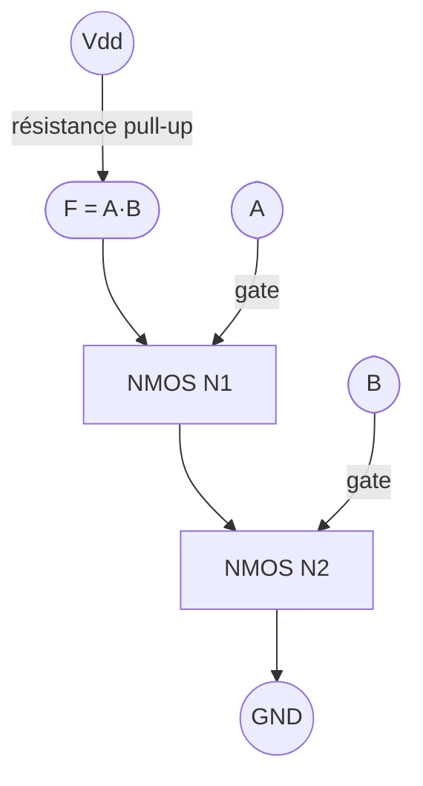

Here’s a handy list of the **most common logic gates in French**, with their English equivalents:

| English        | French                | Symbol / Notes     |
| -------------- | --------------------- | ------------------ |
| AND            | porte ET              | A ⋅ B or A ∧ B     |
| OR             | porte OU              | A + B or A ∨ B     |
| NOT / Inverter | porte NON             | ¬A or A̅           |
| NAND           | porte NON-ET          | ¬(A ⋅ B)           |
| NOR            | porte NON-OU          | ¬(A + B)           |
| XOR            | porte OU exclusif     | A ⊕ B              |
| XNOR           | porte NON-OU exclusif | ¬(A ⊕ B)           |
| BUFFER         | tampon                | just passes signal |

💡 **Tip:** In French textbooks, “porte” = “gate,” and the rest describes the operation.

```mermaid
graph TD
    LUT[LUT / Bloc Logique] --> ET[Porte ET]
    LUT --> OU[Porte OU]
    LUT --> NON[Porte NON]
    LUT --> NAND[Porte NON-ET]
    LUT --> NOR[Porte NON-OU]
    LUT --> XOR[Porte OU Exclusif]
    LUT --> XNOR[Porte NON-OU Exclusif]
    LUT --> TAM[Buffer / Tampon]
```

```mermaid
graph LR
    A([A]) --> G{{AND}}
    B([B]) --> G{{AND}}
    G --> F([F])
```

```mermaid
graph TD
    %% Entrées
    A([A])
    B([B])
    F([F = A·B])
    Vdd((Vdd))
    GND((GND))

    %% Transistors NMOS (pull-down en série)
    N1[NMOS N1]
    N2[NMOS N2]

    %% Connexions NMOS
    F --> N1
    N1 --> N2
    N2 --> GND

    A -->|gate| N1
    B -->|gate| N2

    %% Pull-up externe
    Vdd -->|résistance pull-up| F
```
