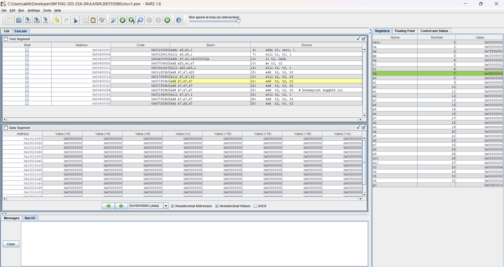
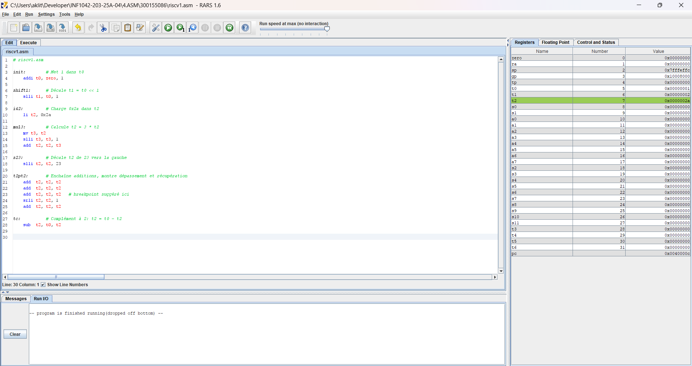

# 💻 Exécution et débogage RISC-V avec RARS

## 👤 Étudiant
- Nom : Tarek Aklit
- Identifiant Boréal : 300155086
- Cours : INF1042 - Architecture et Systèmes
```markdown
 ## 🖼️ Captures d’écran

### ▶️ Exécution dans RARS


### 🐞 Débogage étape par étape


### 📊 Registres et résultats


---

## 🎯 Objectif
Ce projet vise à explorer les instructions assembleur RISC-V à l’aide de l’IDE RARS. L’objectif est de comprendre l’exécution des étiquettes, manipuler les registres, et observer les effets des opérations arithmétiques et logiques.

---

## 📂 Fichiers
- `riscv1.asm` : fichier assembleur contenant les instructions RISC-V
- `images/` : dossier contenant les captures d’écran d’exécution et de débogage

---

## ⚙️ Instructions utilisées

```asm
init:        # Met 1 dans t0
    addi t0, zero, 1

shift1:      # Décale t1 = t0 << 1
    slli t1, t0, 1

i42:         # Charge 0x2a dans t2
    li t2, 0x2a

mul3:        # Calcule t2 = 3 * t2
    mv t3, t2
    slli t3, t3, 1
    add  t2, t2, t3

s23:         # Décale t2 de 23 vers la gauche
    slli t2, t2, 23

t2pt2:       # Enchaîne additions, montre dépassement et récupération
    add  t2, t2, t2
    add  t2, t2, t2
    add  t2, t2, t2
    srli t2, t2, 1
    add  t2, t2, t2

tc:          # Complément à 2: t2 = t0 - t2
    sub  t2, t0, t2
