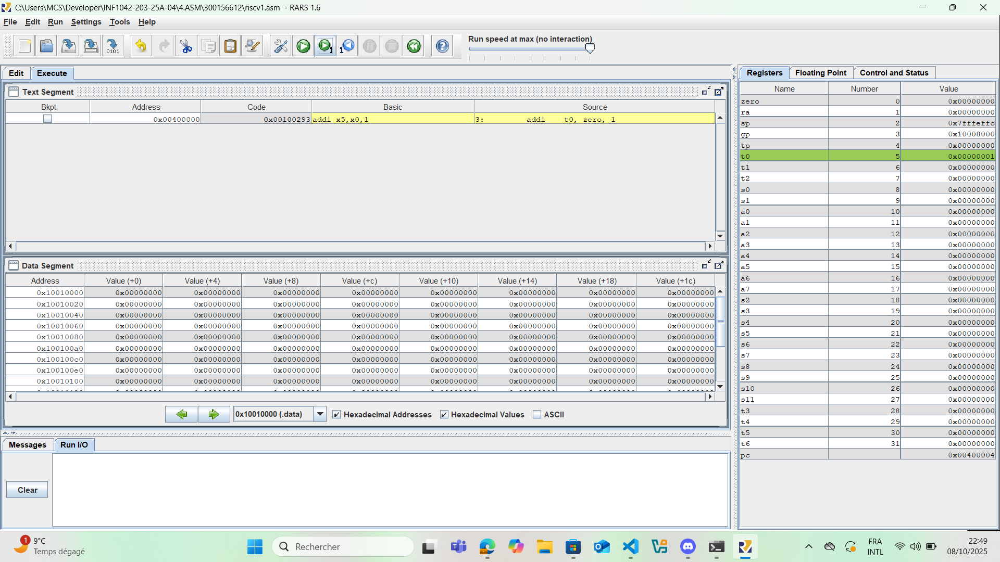

# :abacus: asm

  
détails de install openjdk -y

  Windows PowerShell
Copyright (C) Microsoft Corporation. Tous droits réservés.

Installez la dernière version de PowerShell pour de nouvelles fonctionnalités et améliorations ! https://aka.ms/PSWindows

PS C:\WINDOWS\system32> choco install openjdk -y
Chocolatey v2.5.1
3 validations performed. 2 success(es), 1 warning(s), and 0 error(s).

Validation Warnings:
 - A pending system reboot request has been detected, however, this is
   being ignored due to the current Chocolatey configuration.  If you
   want to halt when this occurs, then either set the global feature
   using:
     choco feature enable --name="exitOnRebootDetected"
   or pass the option --exit-when-reboot-detected.

Installing the following packages:
openjdk
By installing, you accept licenses for the packages.
Downloading package from source 'https://community.chocolatey.org/api/v2/'
Progress: Downloading openjdk 25.0.0.1... 100%

openjdk v25.0.0.1 [Approved]
openjdk package files install completed. Performing other installation steps.
Downloading openjdk 64 bit
  from 'https://download.java.net/java/GA/jdk25/bd75d5f9689641da8e1daabeccb5528b/36/GPL/openjdk-25_windows-x64_bin.zip'
Progress: 100% - Completed download of C:\Users\MCS\AppData\Local\Temp\chocolatey\openjdk\25.0.0.1\openjdk-25_windows-x64_bin.zip (211.35 MB).
Download of openjdk-25_windows-x64_bin.zip (211.35 MB) completed.
Hashes match.
Extracting C:\Users\MCS\AppData\Local\Temp\chocolatey\openjdk\25.0.0.1\openjdk-25_windows-x64_bin.zip to C:\Program Files\OpenJDK...
C:\Program Files\OpenJDK
PATH environment variable does not have C:\Program Files\OpenJDK\jdk-25\bin in it. Adding...
Environment Vars (like PATH) have changed. Close/reopen your shell to
 see the changes (or in powershell/cmd.exe just type `refreshenv`).
 The install of openjdk was successful.
  Deployed to 'C:\Program Files\OpenJDK'
Chocolatey installed 1/1 packages.
 See the log for details (C:\ProgramData\chocolatey\logs\chocolatey.log).
 

 

    
details java --version

openjdk 25 2025-09-16
   
OpenJDK Runtime Environment (build 25+36-3489)

OpenJDK 64-Bit Server VM (build 25+36-3489, mixed mode, sharing)

 

 

    
des photos sur les instrutions en ordre

    
 

    
