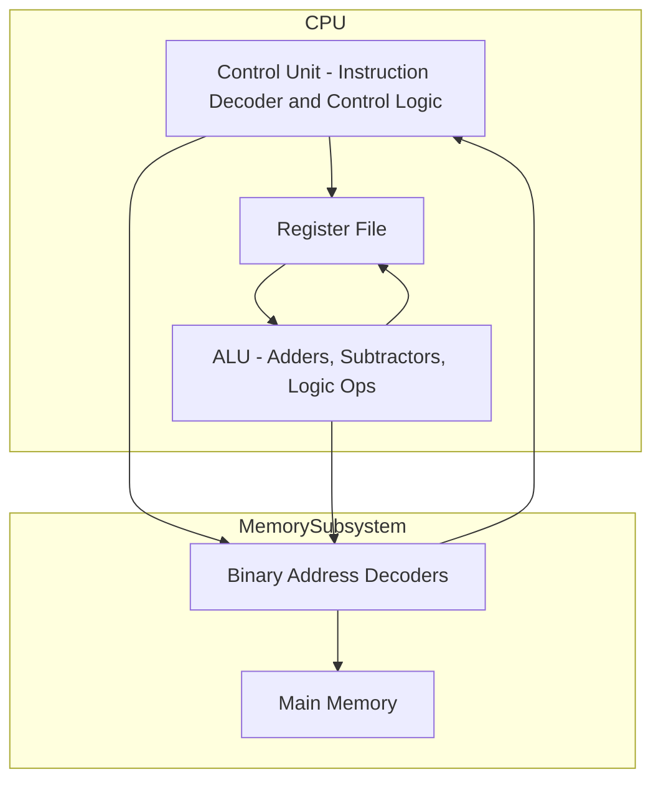

# 4. Assembleur (Assembly - ASM)

[:tada: Participation](.scripts/Participation.md)

<details>
  <summary> :ringed_planet: <b>Table des matières</b> </summary>

  - [:a: - 🧩 Introduction to Logic Circuits](#a----introduction-to-logic-circuits)
    - [🎯 Objectif du chapitre](#-objectif-du-chapitre)
    - [1. 💡 Concepts de base](#-1-concepts-de-base)
    - [2. 🧮 Fonctions logiques](#-2-fonctions-logiques)
    - [3. 🔧 Portes logiques (Logic Gates) fondamentales](#-3-portes-logiques-logic-gates-fondamentales)
    - [4. 🧱 Mise en œuvre de circuits logiques](#-4-mise-en-œuvre-de-circuits-logiques)
    - [5. ⚙️ Simplification des circuits](#-5-simplification-des-circuits)
    - [6. 🔌 Circuits combinatoires courants](#-6-circuits-combinatoires-courants)
    - [7. 🔢 Décodage binaire vers hexadécimal](#-7-décodage-binaire-vers-hexadécimal)
    - [8. 🧠 Introduction à l'assembleur](#-8-introduction-à-lassembleur)
    - [✅ En résumé](#-en-résumé)
  - [:o: Implémentation](#o-implémentation)
    - [:abacus: - Installation de la machine virtuelle Java](#abacus---installation-de-la-machine-virtuelle-java)
    - [🧪 Vérifier l'installation](#🧪-vérifier-linstallation)
  - [:b: Expérimentation](#b-expérimentation)
    - [🎛️ Créer un fichier dans ce répertoire `(4.ASM)`](#🎛️-créer-un-fichier-dans-ce-répertoire-4asm)
    - [:rocket: Lancer l'IDE RARS 1.6](#rocket-lancer-lide-rars-16)
    - [🔄 Exercices](#🔄-exercices)
- [:books: References](#books-references)

</details>

## :a: - 🧩 Introduction to Logic Circuits

### 🎯 Objectif du chapitre

Ce chapitre introduit les **circuits logiques combinatoires**, c’est-à-dire les circuits dont les sorties dépendent uniquement des **valeurs actuelles des entrées** (pas de mémoire).
Il établit le lien entre les **fonctions logiques** (mathématiques booléennes) et leur **implémentation matérielle** (portes logiques [Logic Gates], circuits physiques).

---

### 💡 1. Concepts de base

* **Variables binaires** : peuvent prendre la valeur `0` (faux) ou `1` (vrai).

Le circuit du **Buffer** (Tampon), démontre un boutton permettant d'activer l'interrupteur (switch) physique ôu le transistor permet le passage du courant ou pas

 </img> 

* **Circuit logique** : réseau de **portes logiques (Logic Gates)**[^1] (AND, OR, NOT, etc.) qui manipulent des signaux binaires (0 et 1).

| **NOT** | **AND** (conjonction) | **OR** (disjonction) |
|-|-|-|
|  </img> |  </img> |  </img> |


* **Logique booléenne** : utilisée pour décrire le comportement des circuits.

---

### 🧮 2. Fonctions logiques

* Une **fonction logique** est une expression reliant des entrées binaires à une sortie binaire.
* Peut être représentée sous plusieurs formes :

  * **Table de vérité**
  * **Expression booléenne**

| English        | French           | Symboles / Notes      | Algèbre Booléen   |
| -------------- | -----------------| ----------------------|------------------ |
| AND            |  ET              | A ⋅ B or A ∧ B        | $x_1 \cdot x_2$   |
| OR             |  OU              | A + B or A ∨ B        | $x_1 + x_2$       |
| NOT / Inverter |  NON             | ¬A or A̅               | $\bar{x_1}$       |
| NAND           |  NON-ET          | ¬(A ⋅ B)              | $\overline{(x_1 \cdot x_2)}$ |
| NOR            |  NON-OU          | ¬(A + B)              | $\overline{(x_1 +  x_2)}$ |
| XOR            |  OU exclusif     | A ⊕ B                 | $x_1 \otimes x_2$   |
| XNOR           |  NON-OU exclusif | ¬(A ⊕ B)              | $\overline{(x_1 \otimes  x_2)}$ |
| BUFFER         |  tampon          | passe juste le signal | |
  * **Diagramme logique**

Exemple :
Si $$f = x_1·x_2 + \bar{x_3}$$, cela signifie :
$$f = (x_1 \text{ AND } x_2) \text{ OR } (\text{ NOT } x_3)$$

---

### 🔧 3. Portes logiques (Logic Gates) fondamentales

Les portes physiques de base sont :

| Buffer (Tampon) | **NOT** | **AND** (conjonction) | **OR** (disjonction) |
|-|-|-|-|
|  </img> |  </img> |  </img> |  </img> |

Portes dérivées :

| **NAND** | **NOR** | **XOR**| **XNOR** |
|-|-|-|-|
|  </img> |  </img> |  </img> |  </img> |

**NAND** et **NOR** sont dites **universelles** : on peut construire tout autre circuit à partir d’elles seules.

Par example, reconstruction de **XOR** par **NAND**:  </img>

---

### 🧱 4. Mise en œuvre de circuits logiques

* À partir d’une **table de vérité**, on déduit l’expression booléenne correspondante.
* Deux formes standards :

  * **Sum of Products (SOP)** : somme (OR) de termes produits (AND).
    Exemple : $$f(x_1,x_2) = \bar{x}_1x_2 + x_1\bar{x}_2$$
  * **Product of Sums (POS)** : produit (AND) de sommes (OR).
    Exemple : $$f(x_1,x_2) = (x_1 + x_2)(\bar{x}_1 + \bar{x}_2)$$
* Ces formes peuvent ensuite être simplifiées pour réduire le nombre de portes nécessaires.

---

### ⚙️  5. Simplification des circuits

Méthodes utilisées :

* **Algèbre booléenne** : appliquer des lois (commutative, distributive, absorption, De Morgan, etc.)
* **Karnaugh maps (K-maps)** : représentation graphique permettant de simplifier visuellement une fonction logique à 4 ou 5 variables.

---

### 🔌 6. Circuits combinatoires courants

Le chapitre présente des **blocs logiques standards** :

* **Encodeurs / Décodeurs**
* **Multiplexeurs (MUX) / Démultiplexeurs**
* **Comparateurs**
* **Additionneurs (half-adder, full-adder)**

Ces blocs sont souvent utilisés comme **composants de base** dans des circuits plus complexes.




---

## 🔢 7. Décodage binaire vers hexadécimal

Le système **hexadécimal (base 16)** permet de représenter plus simplement les valeurs **binaires (base 2)**.
Chaque **chiffre hexadécimal correspond à 4 bits**.

| Binaire | Hexa |
| :-----: | :--: |
|   0000  |   0  |
|   0001  |   1  |
|   0010  |   2  |
|   0011  |   3  |
|   0100  |   4  |
|   0101  |   5  |
|   0110  |   6  |
|   0111  |   7  |
|   1000  |   8  |
|   1001  |   9  |
|   1010  |   A  |
|   1011  |   B  |
|   1100  |   C  |
|   1101  |   D  |
|   1110  |   E  |
|   1111  |   F  |

**Méthode :**

1. Regrouper les bits par 4 (à partir de la droite).
2. Remplacer chaque groupe par sa valeur hexadécimale.

**Exemple :**
`1010111100110101₂ = AF35₁₆`

💡 En Assembleur : `xAF35` représente directement ce nombre binaire.

---

### 🧠 8. Introduction à l'assembleur

* Le chapitre introduit brièvement **ASM** l'assembleur pour **décrire et simuler** instructions machines utilisant les circuits logiques.
* Les éléments essentiels :

  * **Tag** : définit les étiquettes.
  * **Register** : décrit les registres interne.
  * **Instructions** : permettent d’écrire des instructions en assembleur.

Examples simple :

```asm
init:
        # put value in T0 register with add`i` (immediate)
	addi	t0, zero, 1

shift1:
	## slli (Shift Logical Left Immediate) by one
	slli t1, t0, 1

i42:
        # li (load immediate)
        li t2, 0x2a

mul3:
	# Load the value from t1 into t2
	# mv t2, t1

	# Load the value from t2 into a temporary register
	mv t3, t2
        
	# Left shift t3 by 1 to double its value (t3 = 2 * t2)
	slli t3, t3, 1

	# Add t3 to t2 to get 3 * t2
	add t2, t2, t3

s23:
        # shift register t2 by 23 positions to the left
        slli t2, t2, 23
        
t2pt2:
         add t2, t2, t2
         add t2, t2, t2 # Set breakpoint
         add t2, t2, t2 # Becomes Negative at third iteration
         srli t2, t2, 1
         add t2, t2, t2 # Recovery

tc:
         sub t2, t0, t2 # 2s complement
```

---

### ✅ En résumé

Le Chapitre établit les **fondations du raisonnement logique en électronique numérique** :

* Comprendre les **relations entre fonctions booléennes et circuits physiques**.
* Savoir **traduire une table de vérité en schéma logique**.
* Apprendre à **simplifier et modéliser** les circuits en **ASM**.


## :o: Implémentation

### :abacus: - Installation de la machine virtuelle Java 

Sous :desktop_computer: `Windows`, ouvrir une fenêtre `PowerShell` en mode :warning: `Administrateur` pour installer `openjdk`, fermer la fenêtre aprés installation

```sh
choco install openjdk -y
```
<details>

```powershell
Chocolatey v2.5.1
Installing the following packages:
openjdk
By installing, you accept licenses for the packages.
Downloading package from source 'https://community.chocolatey.org/api/v2/'
Progress: Downloading openjdk 25.0.0.1... 100%

openjdk v25.0.0.1 [Approved]
openjdk package files install completed. Performing other installation steps.
Downloading openjdk 64 bit
  from 'https://download.java.net/java/GA/jdk25/bd75d5f9689641da8e1daabeccb5528b/36/GPL/openjdk-25_windows-x64_bin.zip'
Progress: 100% - Completed download of C:\Users\300098957\AppData\Local\Temp\chocolatey\openjdk\25.0.0.1\openjdk-25_windows-x64_bin.zip (211.35 MB).
Download of openjdk-25_windows-x64_bin.zip (211.35 MB) completed.
Hashes match.
Extracting C:\Users\300098957\AppData\Local\Temp\chocolatey\openjdk\25.0.0.1\openjdk-25_windows-x64_bin.zip to C:\Program Files\OpenJDK...
C:\Program Files\OpenJDK
PATH environment variable does not have C:\Program Files\OpenJDK\jdk-25\bin in it. Adding...
Environment Vars (like PATH) have changed. Close/reopen your shell to
 see the changes (or in powershell/cmd.exe just type `refreshenv`).
 The install of openjdk was successful.
  Deployed to 'C:\Program Files\OpenJDK'

Chocolatey installed 1/1 packages.
 See the log for details (C:\ProgramData\chocolatey\logs\chocolatey.log).

Enjoy using Chocolatey? Explore more amazing features to take your
experience to the next level at
 https://chocolatey.org/compare
```

### 🧪 Vérifier l'installation


Sous :desktop_computer: `Windows`, ouvrir une fenêtre `PowerShell` en mode `Utilisateur` 

</details>

```sh
java --version
```
<details>

```bash
openjdk 25 2025-09-16
OpenJDK Runtime Environment (build 25+36-3489)
OpenJDK 64-Bit Server VM (build 25+36-3489, mixed mode, sharing)
```

</details>


## :b: Expérimentation

### 🎛️ Créer un fichier dans ce répertoire `(4.ASM)`:

:checkered_flag: Finalement,

- [ ] Créer un répertoire avec :id: (votre identifiant boreal)
   - [ ] `mkdir ` :id:
- [ ] dans votre répertoire ajouter le fichier `README.md`
  - [ ] `nano `README.md
- [ ] envoyer vers le serveur `github.com`
  - [ ] `cd ..`
  - [ ] `git add `:id: 
  - [ ] `git commit -m "mon fichier ..."`
  - [ ] `git push`

### :rocket: Lancer l'IDE [RARS 1.6][RARS 1.6]

- [ ] Se diriger vers le répertoire avec :id: (votre identifiant boreal)
   - [ ] `cd ` :id:
- [ ] Ouvrir l'IDE

```sh
java -jar ..\.lib\rars1_6.jar
```

### 🔄 Exercices

Utiliser l'example ASM donné ci-dessus, éxécuter les étiquettes ASM individuellement et faire une copie d'écran

:bulb: Les instructions de l'assembleur utilisées ici sont de l'architecture Open Source **RISC-V**[^2]

| Exécution | Débuggage |
|-|-|
|  </img> |  </img>|

⚠️ Créer un répertoire `images` pour sauver les copies d'écran

- [ ] Nommer le fichier `Assembleur` riscv1.asm

# :books: References

- [ ] [HOW TRANSISTORS RUN CODE?](https://www.youtube.com/watch?v=HjneAhCy2N4)
- [ ] [RARS 1.6][RARS 1.6]

[RARS 1.6]: https://github.com/TheThirdOne/rars/releases/tag/v1.6

[^1]: https://www.youtube.com/watch?v=sTu3LwpF6XI
[^2]: https://github.com/riscv/riscv-isa-manual

