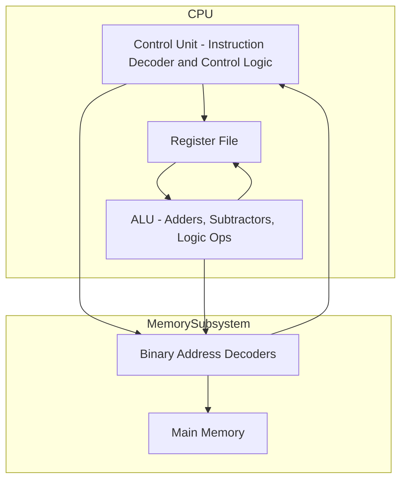

# 4. Assembleur (Assembly - ASM)

## :a: 🧩 Introduction to Logic Circuits

### 🎯 Objectif du chapitre

Ce chapitre introduit les **circuits logiques combinatoires**, c’est-à-dire les circuits dont les sorties dépendent uniquement des **valeurs actuelles des entrées** (pas de mémoire).
Il établit le lien entre les **fonctions logiques** (mathématiques booléennes) et leur **implémentation matérielle** (portes logiques [Logic Gates], circuits physiques).

---

### 1. 💡 Concepts de base

* **Circuit logique** : réseau de **portes logiques** (AND, OR, NOT, etc.) qui manipulent des signaux binaires (0 et 1).
* **Variables binaires** : peuvent prendre la valeur `0` (faux) ou `1` (vrai).
* **Logique booléenne** : utilisée pour décrire le comportement des circuits.

---

### 2. 🧮 Fonctions logiques

* Une **fonction logique** est une expression reliant des entrées binaires à une sortie binaire.
* Peut être représentée sous plusieurs formes :

  * **Table de vérité**
  * **Expression booléenne**
  * **Diagramme logique**

Exemple :
Si $$f = x_1·x_2 + \bar{x_3}$$, cela signifie :
$$f = (x_1 \text{ AND } x_2) \text{ OR } (\text{ NOT } x_3)$$

---

### 3. 🔧 Portes logiques (Logic Gates) fondamentales

Les portes physiques de base sont :

* **NOT** (inversion)
* **AND** (conjonction)
* **OR** (disjonction)

Portes dérivées :

* **NAND** (NOT AND), **NOR** (NOT OR), **XOR** (Combinaison NOT et OR), **XNOR**

**NAND** et **NOR** sont dites **universelles** : on peut construire tout autre circuit à partir d’elles seules.

---

### 4. 🧱 Mise en œuvre de circuits logiques

* À partir d’une **table de vérité**, on déduit l’expression booléenne correspondante.
* Deux formes standards :

  * **Sum of Products (SOP)** : somme (OR) de termes produits (AND).
    Exemple : $$f(x_1,x_2) = \bar{x}_1x_2 + x_1\bar{x}_2$$
  * **Product of Sums (POS)** : produit (AND) de sommes (OR).
    Exemple : $$f(x_1,x_2) = (x_1 + x_2)(\bar{x}_1 + \bar{x}_2)$$
* Ces formes peuvent ensuite être simplifiées pour réduire le nombre de portes nécessaires.

---

### 5. ⚙️ Simplification des circuits

Méthodes utilisées :

* **Algèbre booléenne** : appliquer des lois (commutative, distributive, absorption, De Morgan, etc.)
* **Karnaugh maps (K-maps)** : représentation graphique permettant de simplifier visuellement une fonction logique à 4 ou 5 variables.

---

### 6. 🔌 Circuits combinatoires courants

Le chapitre présente des **blocs logiques standards** :

* **Encodeurs / Décodeurs**
* **Multiplexeurs (MUX)**
* **Démultiplexeurs**
* **Comparateurs**
* **Additionneurs (half-adder, full-adder)**

Ces blocs sont souvent utilisés comme **composants de base** dans des circuits plus complexes.




---

### 7. 🧠 Introduction à l'assembleur

* Le chapitre introduit brièvement **ASM** l'assembleur pour **décrire et simuler** instructions machines utilisant les circuits logiques.
* Les éléments essentiels :

  * **Tag** : définit les étiquettes.
  * **Register** : décrit les registres interne.
  * **Instructions** : permettent d’écrire des instructions en assembleur.

Examples simple :

```asm
init:
        # put value in T0 register with add`i` (immediate)
	addi	t0, zero, 1

shift1:
	## slli (Shift Logical Left Immediate) by one
	slli t1, t0, 1

i42:
        # li (load immediate)
        li t2, 0x2a

mul3:
	# Load the value from t1 into t2
	# mv t2, t1

	# Load the value from t2 into a temporary register
	mv t3, t2
        
	# Left shift t3 by 1 to double its value (t3 = 2 * t2)
	slli t3, t3, 1

	# Add t3 to t2 to get 3 * t2
	add t2, t2, t3

s23:
        # shift register t2 by 23 positions to the left
        slli t2, t2, 23
        
t2pt2:
         add t2, t2, t2
         add t2, t2, t2 # Set breakpoint
         add t2, t2, t2 # Becomes Negative at third iteration
         srli t2, t2, 1
         add t2, t2, t2 # Recovery

tc:
         sub t2, t0, t2 # 2s complement
```

---

### ✅ En résumé

Le Chapitre établit les **fondations du raisonnement logique en électronique numérique** :

* Comprendre les **relations entre fonctions booléennes et circuits physiques**.
* Savoir **traduire une table de vérité en schéma logique**.
* Apprendre à **simplifier et modéliser** les circuits en **ASM**.


## :abacus: - Installation de la machine virtuelle Java 

```sh
choco install openjdk -y
```
<details>

```powershell
Chocolatey v2.5.1
Installing the following packages:
openjdk
By installing, you accept licenses for the packages.
Downloading package from source 'https://community.chocolatey.org/api/v2/'
Progress: Downloading openjdk 25.0.0.1... 100%

openjdk v25.0.0.1 [Approved]
openjdk package files install completed. Performing other installation steps.
Downloading openjdk 64 bit
  from 'https://download.java.net/java/GA/jdk25/bd75d5f9689641da8e1daabeccb5528b/36/GPL/openjdk-25_windows-x64_bin.zip'
Progress: 100% - Completed download of C:\Users\300098957\AppData\Local\Temp\chocolatey\openjdk\25.0.0.1\openjdk-25_windows-x64_bin.zip (211.35 MB).
Download of openjdk-25_windows-x64_bin.zip (211.35 MB) completed.
Hashes match.
Extracting C:\Users\300098957\AppData\Local\Temp\chocolatey\openjdk\25.0.0.1\openjdk-25_windows-x64_bin.zip to C:\Program Files\OpenJDK...
C:\Program Files\OpenJDK
PATH environment variable does not have C:\Program Files\OpenJDK\jdk-25\bin in it. Adding...
Environment Vars (like PATH) have changed. Close/reopen your shell to
 see the changes (or in powershell/cmd.exe just type `refreshenv`).
 The install of openjdk was successful.
  Deployed to 'C:\Program Files\OpenJDK'

Chocolatey installed 1/1 packages.
 See the log for details (C:\ProgramData\chocolatey\logs\chocolatey.log).

Enjoy using Chocolatey? Explore more amazing features to take your
experience to the next level at
 https://chocolatey.org/compare
```

## Vérifier l'installation

</details>

```sh
java --version
```
<details>

```bash
openjdk 25 2025-09-16
OpenJDK Runtime Environment (build 25+36-3489)
OpenJDK 64-Bit Server VM (build 25+36-3489, mixed mode, sharing)
```

</details>


```sh
java -jar ..\.lib\rars1_6.jar
```

## :books: Implementation

Utiliser l'example donner ci-dessus

# :books: References

[RARS 1.6][RARS 1.6]

[RARS 1.6]: https://github.com/TheThirdOne/rars/releases/tag/v1.6

# :books: References

- [ ] [HOW TRANSISTORS RUN CODE?](https://www.youtube.com/watch?v=HjneAhCy2N4)
